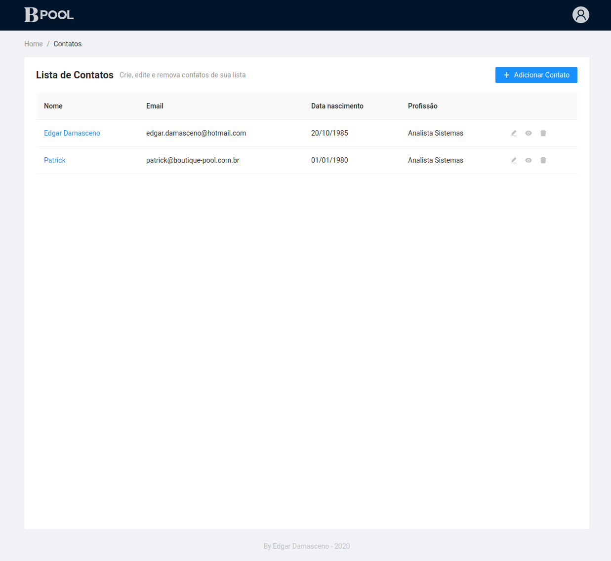
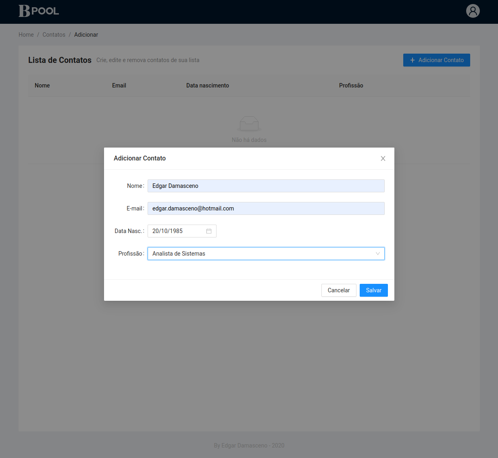
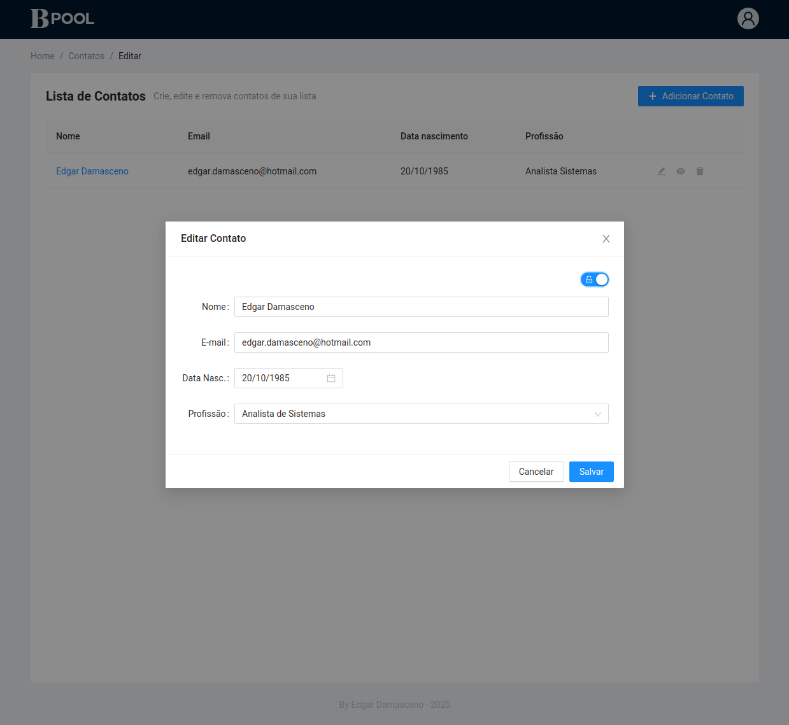
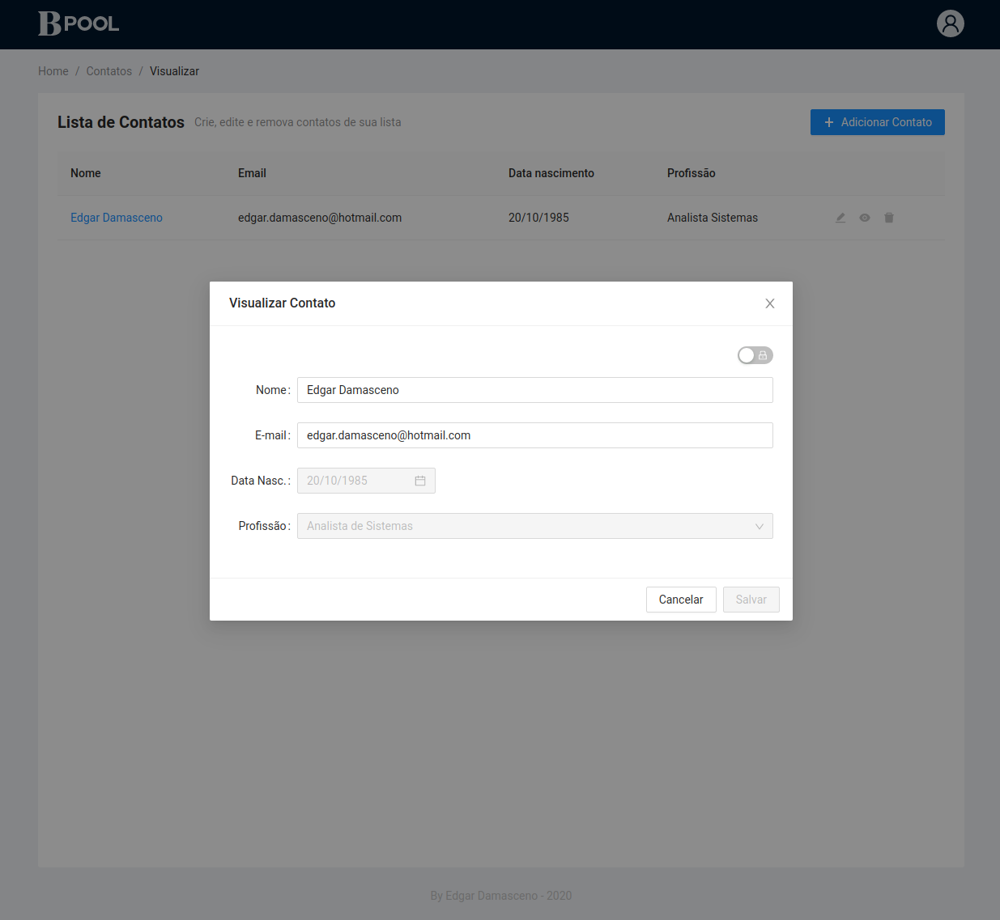
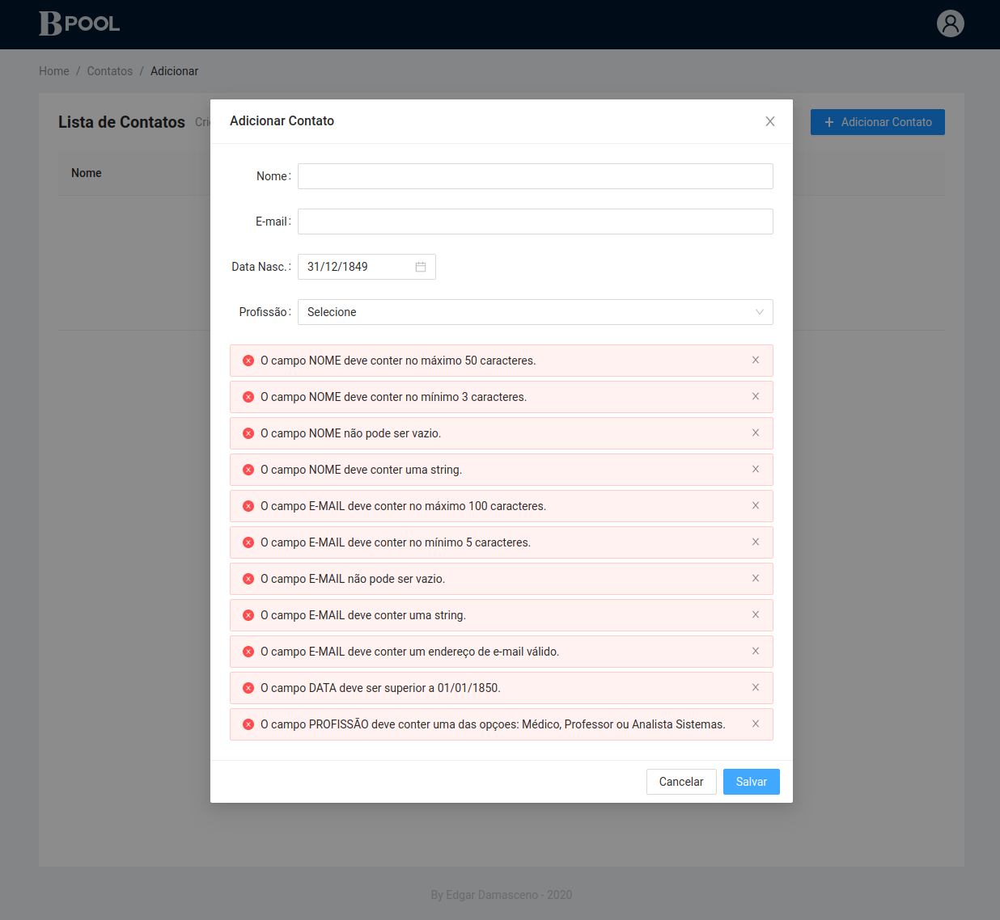
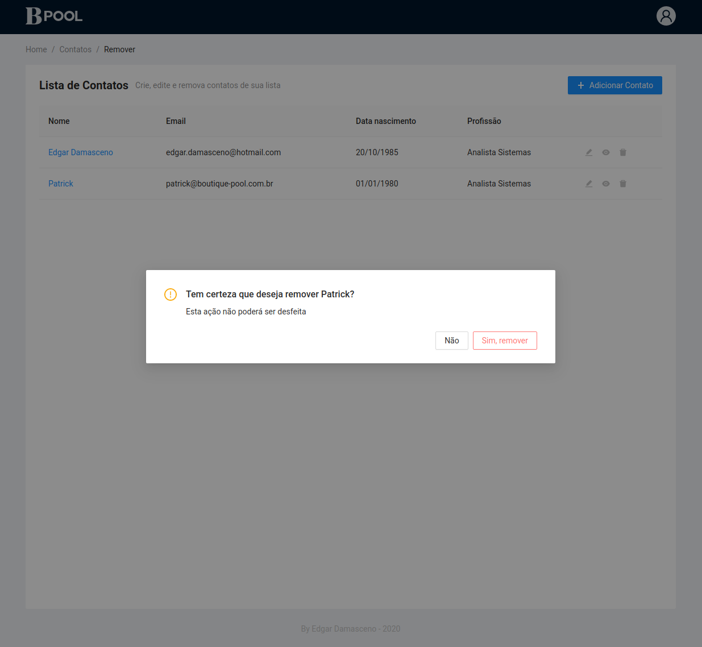

# BPOOL Assignment
<div style="text-align: right"><sub>by Edgar Damasceno</sub></div>

[Descrição do desafio](./docs/teste.md)

> Este é um monorepo; back-end, front-end, scripts, configurações e tudo que for necessário para a execução e deploy da aplicação em um só lugar.

## Implementação
- API em [NodeJS](https://nodejs.org/en/) utilizando o framework [NestJS](https://nestjs.com/).
- SPA utilizando [ReactJS](https://reactjs.org/) e design system utilizando [Ant Design](https://ant.design/).

## Pré-Requisitos
- [Docker](https://docs.docker.com/engine/install/)
- [Docker Compose](https://docs.docker.com/compose/install/)

<hr/>

## Executando

### Ambiente de Desenvolvimento
Para executar a aplicação em ambiente de desenvolvimento com recurso de hot reload (front-end e back-end) utilize os seguintes comandos:

```console
    docker-compose -f docker-compose.dev.yml down
    docker-compose -p bpool_dev -f docker-compose.dev.yml up --build --force-recreate --always-recreate-deps
```

ou execute o script `run-app-deploy.sh` passando `--dev` como parâmetro:

```console
$ ./run-app-deploy.sh --dev
```

> OBS: Será necessário re-executar o comando acima aṕos a instalação de pacotes no front-end ou back-end para que as alterações surtam efeito.

Execute este comando para se certificar que a aplicação está sendo executada. 

```console
docker ps --format "table {{.Names}}\t{{.Ports}}" | grep "^bpool_dev_"
```
Resultado:

```console
bpool_dev_app_1         0.0.0.0:3000->3000/tcp
bpool_dev_api_1         0.0.0.0:4000->4000/tcp
bpool_dev_database_1    0.0.0.0:27017->27017/tcp
```
Os três containeres acima devem aparecer como resultado.

O output das operações e falhas dos containeres será axibido no terminal em tempo real. Para finalizar, pressione `Ctrl+C`. 

Acesse [http://localhost:3000](http://localhost:3000).
<hr/>

### Ambiente de Produção
Para executar a aplicação em ambiente de produção com código transpilado e otimizado (front-end e back-end) utilize os seguintes comandos:

```console
$ cp dev.env prod.env
```
> Altere valores das variáveis de ambiente conforme o exemplo abaixo, substituindo apenas **nome_do_banco_de_dados**, **nome_do_usuario_mongo** e **senha_do_usuario_mongo** por valores de sua preferência.

```env
ENV=production

API_PORT=80

REACT_APP_PORT=80
REACT_APP_API_BASEURL=http://localhost/api/

MONGO_HOST=database
MONGO_PORT=27017

MONGO_INITDB_DATABASE=nome_do_banco_de_dados
MONGO_INITDB_ROOT_USERNAME=nome_do_usuario_mongo
MONGO_INITDB_ROOT_PASSWORD=senha_do_usuario_mongo
```

Execute os comando do docker-compose abaixo para construir e iniciar a aplicação:

```console
$ docker-compose -f docker-compose.prod.yml down
$ docker-compose -f docker-compose.prod.yml up -d --build --force-recreate --always-recreate-deps
```

ou execute o script `run-app-deploy.sh` passando `--prod` como parâmetro:

```console
$ ./run-app-deploy.sh --prod
```

Execute este comando para se certificar que a aplicação está sendo executada. 

```console
docker ps --format "table {{.Names}}\t{{.Ports}}" | grep "^bpool_prod_"
```
Resultado:

```console
bpool_prod_app_1        0.0.0.0:80->80/tcp
bpool_prod_api_1        0.0.0.0:49166->80/tcp
bpool_prod_database_1   0.0.0.0:49165->27017/tcp
```
Os três containeres acima devem aparecer como resultado.

> O output das operações e falhas dos containeres **não** será exibido. Para ter acesso aos logs (1000 últimas linhas) dos containeres utilize os seguintes comandos:

```console
$ docker logs --tail 1000 bpool_prod_app_1 
$ docker logs --tail 1000 bpool_prod_api_1 
$ docker logs --tail 1000 bpool_prod_database_1 
```

Acesse [http://localhost](http://localhost).
<hr/>

## API

Para testar a API utilizei o software [Insomnia](https://insomnia.rest/download/); A configuração de rotas que utilizei pode ser acessada neste [link](./docs/insomnia_workspace).
### Endpoints

- /api/contact, POST
- /api/contact, GET
- /api/contact/:id, GET
- /api/contact/:id, PUT
- /api/contact/:id, DELETE

### Validações e Mensagens de erro

> O campo NOME deve conter uma string.

> O campo NOME não pode ser vazio.

> O campo NOME deve conter no mínimo 3 caracteres.

> O campo NOME deve conter no máximo 50 caracteres.

> O campo E-MAIL deve conter um endereço de e-mail válido.

> O campo E-MAIL deve conter uma string.

> O campo E-MAIL não pode ser vazio.

> O campo E-MAIL deve conter no mínimo 5 caracteres.

> O campo E-MAIL deve conter no máximo 100 caracteres.

> O campo DATA NASCIMENTO deve conter uma data válida.

> O campo DATA NASCIMENTO não pode ser vazio.

> O campo DATA deve ser superior a 01/01/1850.

> O campo DATA deve ser inferior à data atual.

> O campo PROFISSÃO deve conter uma das opçoes: Médico, Professor ou Analista Sistemas.

> O campo PROFISSÃO não pode ser vazio.

> Operação cancelada. Contato não localizado.

> Operação cancelada. O campo _ID é imutável.

## TODO

- [x] Criar boilerplate (front-end e back-end)
- [x] Containerizar ambiente de desenvolvimento
- [x] Implementar front-end
- [x] Implementar back-end
- [x] Integrar front-end e back-end
- [x] Containerizar ambiente de produção

## Caputuras de Tela

### Lista de Contatos


### Adicionar Contato


### Editar Contato


### Visualizar Contato


### Listagem de Erros na Validação


### Remover Contato (confirmação)

