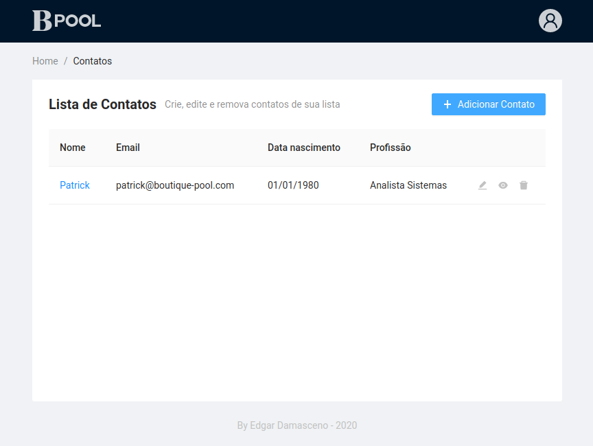
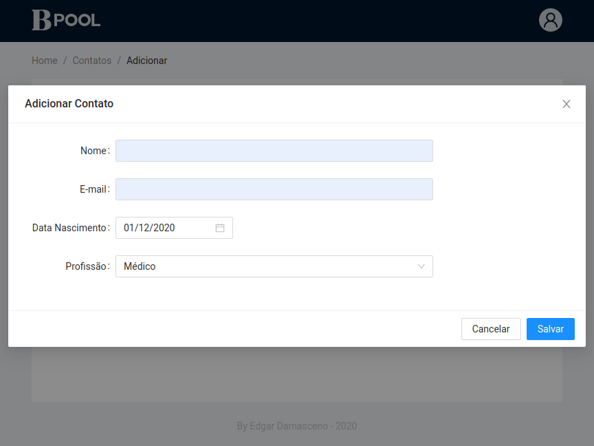
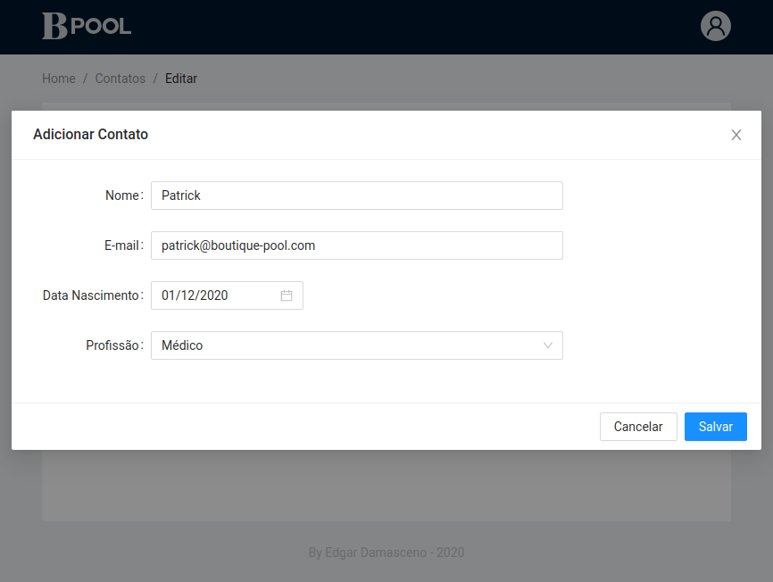
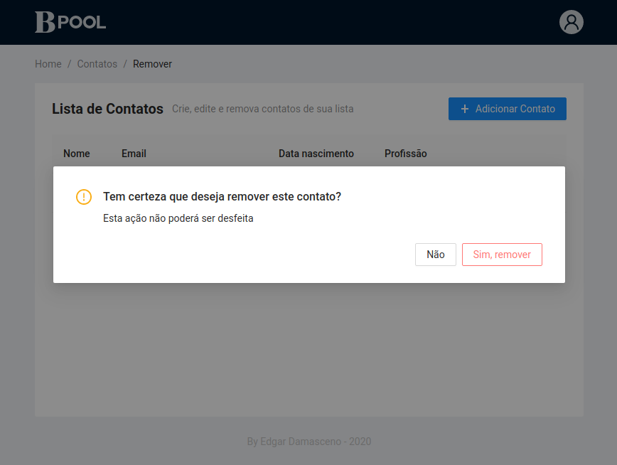

# BPOOL Assignment
<div style="text-align: right"><sub>by Edgar Damasceno</sub></div>

[Descrição do desafio](./doc/teste.md)

> Este é um monorepo; back-end, front-end, scripts, configurações e tudo que for necessário para a execução e deploy da aplicação em um só lugar.

## Implementação
- API em [NodeJS](https://nodejs.org/en/) utilizando o framework [NestJS](https://nestjs.com/).
- SPA utilizando [ReactJS](https://reactjs.org/) e design system utilizando [Ant Design](https://ant.design/).

## Pré-Requisitos
- [Docker](https://docs.docker.com/engine/install/)
- [Docker Compose](https://docs.docker.com/compose/install/)

## Executando

### Ambiente de Desenvolvimento
Para executar a aplicação em ambiente de desenvolvimento com recurso de hot reload (front-end e back-end) utilize os seguintes comandos:

```console
$ docker-compose -f docker-compose.dev.yml down
$ docker-compose -f docker-compose.dev.yml up --build
```

ou execute o script `run-app-deploy.sh` passando `--dev` como parâmetro:

```console
$ ./run-app-deploy.sh --dev
```

> OBS: Será necessário re-executar o comando acima aṕos a instalação de pacotes no front-end ou back-end para que as alterações surtam efeito.


## API

Para testar a API utilizei o software [Insomnia](https://insomnia.rest/download/); A configuração de rotas que utilizei pode ser acessada neste [link](./doc/insomnia_workspace).
### Endpoints

- /api/contact, POST
- /api/contact, GET
- /api/contact/:id, GET
- /api/contact/:id, PUT
- /api/contact/:id, DELETE

### Validações e Mensagens de erro

> O campo NOME deve conter uma string.

> O campo NOME não pode ser vazio.

> O campo NOME deve conter no mínimo 3 caracteres.

> O campo NOME deve conter no máximo 50 caracteres.

> O campo E-MAIL deve conter um endereço de e-mail válido.

> O campo E-MAIL deve conter uma string.

> O campo E-MAIL não pode ser vazio.

> O campo E-MAIL deve conter no mínimo 5 caracteres.

> O campo E-MAIL deve conter no máximo 100 caracteres.

> O campo DATA NASCIMENTO deve conter uma data válida.

> O campo DATA NASCIMENTO não pode ser vazio.

> O campo DATA deve ser superior a 01/01/1850.

> O campo DATA deve ser igual ou inferior à data atual.

> O campo PROFISSÃO deve conter uma das opçoes: Médico, Professor ou Analista Sistemas.

> O campo PROFISSÃO não pode ser vazio.

> Operação cancelada. Contato não localizado.

> Operação cancelada. O campo _ID é imutável.

## TODO

- [x] Criar boilerplate (front-end e back-end)
- [x] Containerizar ambiente de desenvolvimento
- [x] Implementar front-end
- [x] Implementar back-end
- [ ] Integrar front-end e back-end
- [ ] Containerizar ambiente de produção

## Caputuras de tela

### Lista de Contatos


### Adicionar Contato


### Editar Contato


### Visualizar Contato


### Remover Contato (confirmação)

