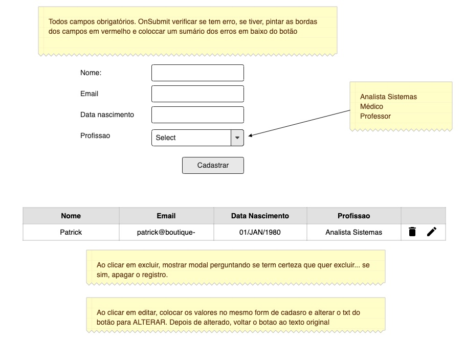

# Desafio

Deadline: qua, 09 de dezembro de 2020

## Teste SPA (Front & Back)

### Wireframe

### Requisitos

Você deverá fazer como achar que tem de ser feito. Será avaliado a sua criatividade/conhecimento, organização de código, pattern usadas, cuidados com performance, validações, testes, componentização, etc... Pode colocar tudo dentro de um docker e mandar as instruções de como rodar.

- Colocar no seu Git todo código (back & front)
- Tem de ser em .Net Core C# ou NodeJS
- Tem de usar framework React com o Framework [Ant Design](https://ant.design/components/overview/)
- Banco de dados MongoDB
